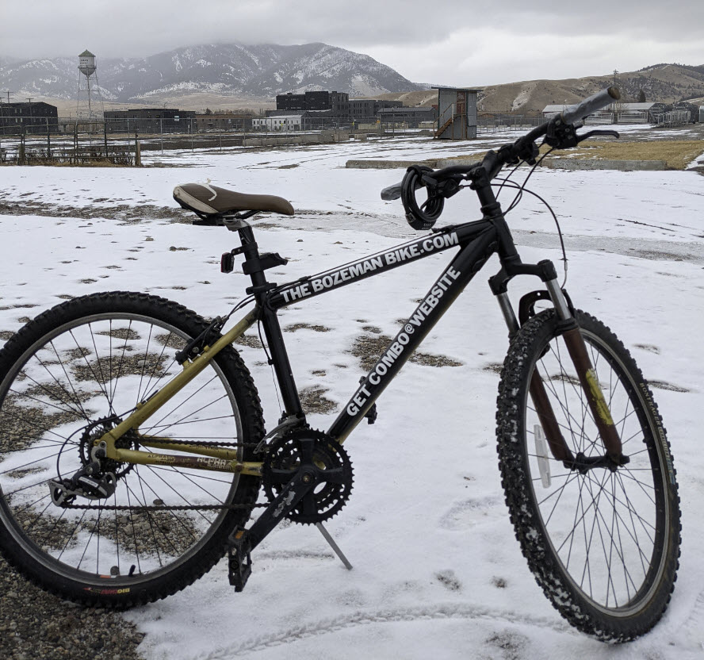

## How much does it cost?
Free.

## How does it work?
Follow the instructions [here](https://thebozemanbike.com).

## How does it make money?
It doesn't.

## What stops me from stealing the bike once I get the combination?
Your conscience. 

## How far can I go?
As far as your imagination will take you- as long as you return it back to town when you are done.

## What is the longest I can use it for?
If you have to ask, then it is probably too long. Let other people use it too.

## How can I turn an extra bike that have into a Bozeman Bike?
Text me at the number on this [page](https://thebozemanbike.com) and we will pow wow. 

## Why?
Social experiement. Performace art peice. Too lazy to sell on craigslist.

## What is the back story?
Thanks to a serindipitus pawn shop encounter, I came into a bike that was cheaper to buy than to rent. That very same pawn shop bike would someday become The Bozeman Bike you all now know and love.

## How can I keep up to date with the latest Bozeman Bike news?
Become a Bozeman Bike Buddie by <a href = "mailto:bbbb@thebozemanbike.com?subject=The%20Bozeman%20Bike%20Buddie%20Program&body=I desperately want to become a Bozeman Bike Buddie. I herby pledge to you that I will strive each and every day to prove that I am worthy of this honor. Thank you for making all of this this possible.%0D%0AYour friend and confidant,%0D%0A[you name here]">clicking here</a>
.

<!-- Default Statcounter code for bozeman bike
http://thebozemanbike.com -->

<noscript>

</noscript>
<!-- End of Statcounter Code -->
